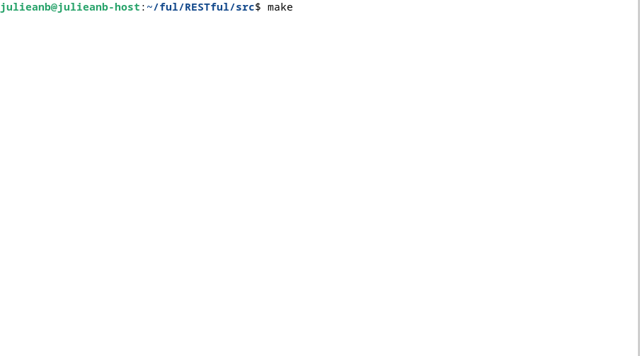
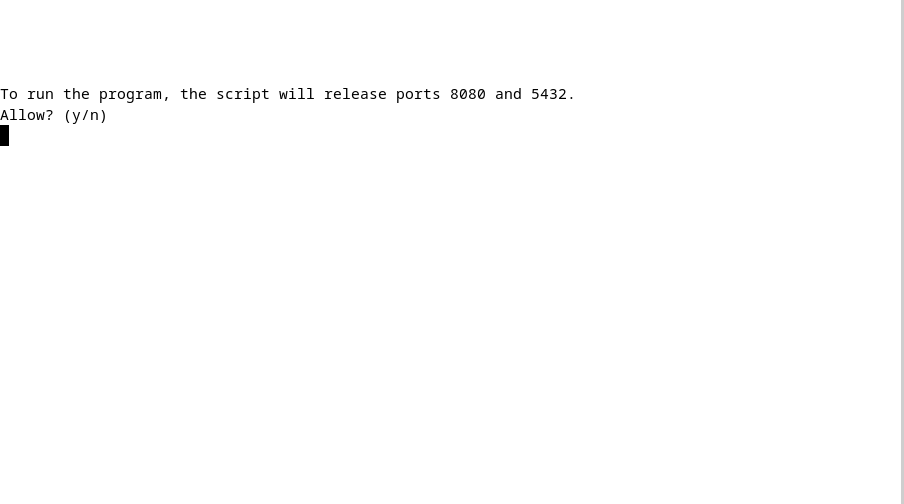
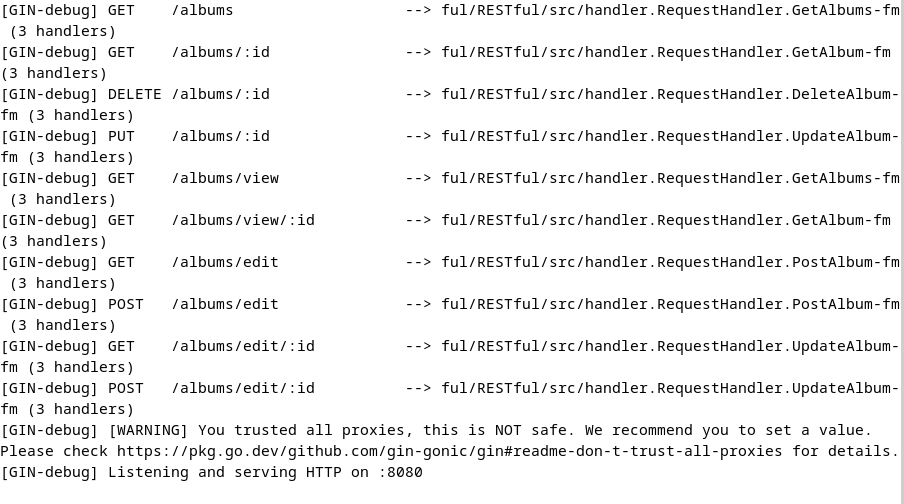

## Albums
### Made by Julieanb
## 10.12.2023

- An independent project Albums, the purpose of which is to study go.

- The application is a CRUD providing a Web API to the data.

- Postgres was used as a database.

- The database is run from a container using docker-compose.

- Gin was used as the HTTP Framework.

- Logrus is used to log errors.

- The logs are located in the logs folder, logs.txt - main logs, tests_logs.txt - test logs.

- The program uses ports 8080 and 5432.

## Makefile targets

- all: Starts a container with a database in the background and a server 
with the gin debugger output to the console. Pre-cleanses ports 8080 and 5432.

- test: Collects tests and displays the result in the console.

- coverage: Collects tests, checks coverage with output to the browser.

- build: Compiles go files to /src/program.

- clean: Cleaning logs, executable files, test files.

- cleanall: Executes the clean goal, additionally stops and 
deletes the container with the database, cleans ports 8080 and 5432.

- dbup: Starts a database container.

- dbdown: Stops and deletes the database container.

## Examples

### --I--

To run the program, just execute the all goal inside the src folder. After this, 
the program will prepare a container with the database and ask you to clear the ports. 
The database will run in the background, the server will output gin-debug to the console.